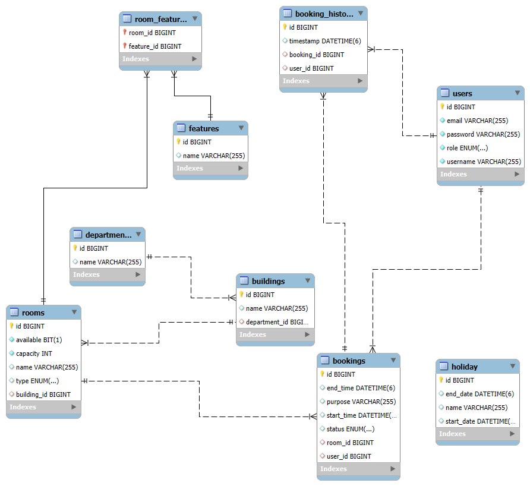

# University Room Booking System

A secure, modular, and testable RESTful API built with Spring Boot to manage classroom and lab reservations. It supports browsing room availability, booking date/time slots, admin approval workflows, cancellations, history views, and robust role-based access control with JWT.

## Tech Stack

- Java 17
- Spring Boot (Web, Data JPA, Security, Validation, Lombok)
- MySQL (production database)
- H2 (in-memory database for development and testing)
- JWT (JSON Web Tokens) for authentication/authorization

---

## Quick Start

### Prerequisites

- Java 17 installed and on PATH
- Maven 3.9+ or Gradle 8+ (choose one)

### Clone and run

Using Maven:
```bash
mvn clean spring-boot:run
```
Using Gradle:
```bash
gradle bootRun
```
Build an executable JAR:
```bash
mvn clean package
java -jar target/voting-system-*.jar
```
The API will start at:
```
http://localhost:8080
```

### Entity Diagram


---

## Configuration

Edit `src/main/resources/application.properties` to customize:
```properties
# App
spring.application.name=university-room-booking

# MySQL database (for production)
spring.datasource.url=jdbc:mysql://localhost:3306/university_room_booking_db
spring.datasource.username=root
spring.datasource.password=root

# JPA & Hibernate
spring.jpa.hibernate.ddl-auto=update

# JWT (1 hour)
jwt.expiration=3600000
```
Notes:
- JWT tokens include a role claim and expire according to `jwt.expiration`.

---

## Authentication and Authorization

- Authentication: JWT-based
- Roles: `STUDENT`, `FACULTY_MEMBER`, `ADMIN`
- How it works:
    1. Register a user.
    2. Login to receive a JWT token.
    3. Send the JWT token with requests using the Authorization header: `Authorization: Bearer <TOKEN>`.

### Endpoints (Auth and User)

Base path for auth: `/auth`

- POST `/auth/register` — register a new user account
- POST `/auth/login` — login and receive JWT token
- GET `/auth/me` — returns the current authenticated user profile

Login request example:
```http
POST /auth/login HTTP/1.1
Host: localhost:8080
Content-Type: application/json

{
  "username": "<USERNAME>",
  "password": "<PASSWORD>"
}
```
Login response example:
```json
{
  "token": "<JWT_TOKEN_STRING>"
}
```
Use the token on subsequent requests:
```http
Authorization: Bearer <JWT_TOKEN_STRING>
```

---

### Department Controller - `/api/departments`

| Method | Endpoint                | Request Body        | Action                    | Role  |
|--------|-------------------------|---------------------|---------------------------|-------|
| POST   | `/api/departments`      | CreateDepartmentDto | Create a new department   | ADMIN |
| GET    | `/api/departments`      | None                | Get all departments       | ANY   |
| GET    | `/api/departments/{id}` | None                | Get a department by ID    | ANY   |
| PUT    | `/api/departments/{id}` | CreateDepartmentDto | Update a department by ID | ADMIN |
| DELETE | `/api/departments/{id}` | None                | Delete a department by ID | ADMIN |

---

### Building Controller - `/api/buildings`

| Method | Endpoint              | Request Body       | Action                    | Role  |
|--------|-----------------------|--------------------|---------------------------|-------|
| POST   | `/api/buildings`      | CreateBuildingDto  | Create a new building     | ADMIN |
| GET    | `/api/buildings`      | None               | Get all buildings         | ANY   |
| GET    | `/api/buildings/{id}` | None               | Get a building by ID      | ANY   |
| PUT    | `/api/buildings/{id}` | CreateBuildingDto  | Update a building by ID   | ADMIN |
| DELETE | `/api/buildings/{id}` | None               | Delete a building by ID   | ADMIN |

---

### Room Feature Controller - `/api/features`

| Method | Endpoint             | Request Body         | Action                      | Role  |
|--------|----------------------|----------------------|-----------------------------|-------|
| POST   | `/api/features`      | CreateRoomFeatureDto | Create a new room feature   | ADMIN |
| GET    | `/api/features`      | None                 | Get all room features       | ANY   |
| GET    | `/api/features/{id}` | None                 | Get a room feature by ID    | ANY   |
| PUT    | `/api/features/{id}` | RoomFeatureDto       | Update a room feature by ID | ADMIN |
| DELETE | `/api/features/{id}` | None                 | Delete a room feature by ID | ADMIN |

---

### Room Controller - `/api/rooms`

| Method | Endpoint                           | Request Body             | Action                               | Role  |
|--------|------------------------------------|--------------------------|--------------------------------------|-------|
| POST   | `/api/rooms`                       | RoomRequestDto           | Create a new room                    | ADMIN |
| GET    | `/api/rooms`                       | None                     | Get all rooms                        | ANY   |
| GET    | `/api/rooms/{id}`                  | None                     | Get a room by ID                     | ANY   |
| PUT    | `/api/rooms/{id}`                  | RoomRequestDto           | Update a room by ID                  | ADMIN |
| DELETE | `/api/rooms/{id}`                  | None                     | Delete a room by ID                  | ADMIN |
| POST   | `/api/rooms/{roomId}/availability` | AvailabilityRequestDto   | Get availability for a specific room | ANY   |

---

### Holiday Controller - `/api/holidays`

| Method | Endpoint               | Request Body        | Action                           | Role  |
|--------|------------------------|---------------------|----------------------------------|-------|
| POST   | `/api/holidays`        | HolidayRequestDto   | Create a new holiday             | ADMIN |
| GET    | `/api/holidays`        | None                | Get all holidays                 | ANY   |
| GET    | `/api/holidays/{name}` | None                | Get a holiday by name            | ANY   |
| PUT    | `/api/holidays/{id}`   | HolidayRequestDto   | Update a holiday by ID           | ADMIN |
| DELETE | `/api/holidays/{name}` | None                | Delete a holiday by name         | ADMIN |

---

### Booking Controller - `/api/bookings`

| Method | Endpoint                                           | Request Body             | Action                             | Role                    |
|--------|----------------------------------------------------|--------------------------|------------------------------------|-------------------------|
| POST   | `/api/bookings`                                    | CreateBookingRequestDto  | Create a new booking               | STUDENT, FACULTY_MEMBER |
| GET    | `/api/bookings/users/{userId}/recurring-bookings`  | None                     | Get top recurring rooms for a user | ANY                     |
| GET    | `/api/bookings/status/{status}`                    | None                     | Get all bookings by status         | ADMIN                   |
| POST   | `/api/bookings/{id}/approve`                       | None                     | Approve a booking                  | ADMIN                   |
| POST   | `/api/bookings/{id}/reject`                        | RejectBookingDto         | Reject a booking                   | ADMIN                   |
| POST   | `/api/bookings/{id}/cancel`                        | None                     | Cancel a booking                   | STUDENT, FACULTY_MEMBER |

---

### Availability Controller - `/api/availability`

| Method | Endpoint                            | Request Body            | Action                                | Role |
|--------|-------------------------------------|-------------------------|---------------------------------------|------|
| POST   | `/api/availability/room/{roomName}` | AvailabilityRequestDto  | Check if a specific room is available | ANY  |

---

## Error Handling

- 400 Bad Request — validation errors or malformed input
- 401 Unauthorized — missing or invalid JWT
- 403 Forbidden — insufficient permissions (e.g., `STUDENT` trying to access admin endpoints)
- 404 Not Found — resource not found
- 409 Conflict — conflicting operations (e.g., registering with an existing username)

Error responses include a message that explains the issue.

---

## Troubleshooting

- Application fails to start with MySQL connection error:
    - Check username/password in `application.properties`.
    - Ensure MySQL server is running and `university_room_booking_db` database exists.
- 401 Unauthorized:
    - Ensure you’re sending `Authorization: Bearer <TOKEN>` and the token has not expired.
    - the Token will be invalid if the application is restarted since there is no persistent token store.
- 403 Forbidden:
    - Verify your account role matches the endpoint’s required access.

---